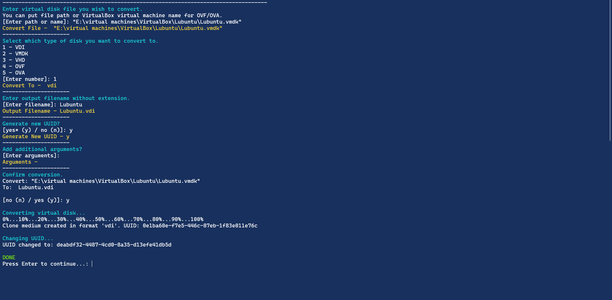

# vBoxManage Interactive Virtual Disk Converter
 A simple, interactive script for converting virtual disk formats using VBoxManage.

# Requirements
* Powershell (was made and tested with Powershell 7)  
* You must have vBoxManage.exe on your system. It comes with VirtualBox.

# Installation
* Open in PowerShell by running `vdconvert.ps1` or `./vdconvert.ps1`.
